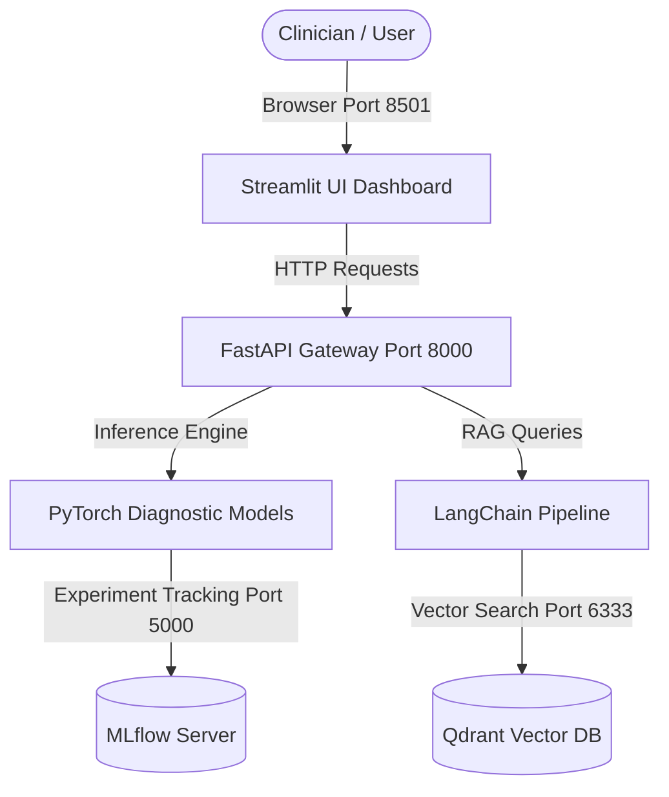

# NeuroCare-AI

[](https://www.python.org/downloads/)
[](https://fastapi.tiangolo.com/)
[](https://streamlit.io/)
[](https://pytorch.org/)
[](https://langchain.com/)
[](https://qdrant.tech/)
[](https://mlflow.org/)
[](https://www.docker.com/)

**NeuroCare-AI** is a production-ready artificial intelligence platform engineered for clinical neurological care, diagnostic decision support, and Retrieval-Augmented Generation (RAG) over medical literature and clinical protocols.

---

## System Architecture



---

## Project Directory Structure

```text
NeuroCare-AI/
├── .env.example              # Environment variables template
├── .gitignore                # Production Python/ML ignore rules
├── Dockerfile                # Multi-stage container definition (API & UI)
├── docker-compose.yml        # Orchestration (FastAPI, Streamlit, Qdrant, MLflow)
├── requirements.txt          # Production dependencies
├── README.md                 # Project documentation & runbook
├── configs/
│   └── config.yaml           # Centralized configuration (model, RAG, logging)
├── data_raw/
│   └── .gitkeep              # Raw medical datasets & patient telemetry
├── data_processed/
│   └── .gitkeep              # Cleaned, normalized feature tensors
├── models/
│   └── .gitkeep              # Trained PyTorch model weights & checkpoints
├── rag_index/
│   └── .gitkeep              # Local vector embeddings & cached indices
├── logs/
│   └── .gitkeep              # Application & training log outputs
├── app/
│   ├── __init__.py
│   ├── api/
│   │   ├── __init__.py
│   │   └── main.py           # FastAPI REST API ("Hello NeuroCare")
│   └── ui/
│       ├── __init__.py
│       └── dashboard.py      # Streamlit Clinical Dashboard ("Hello NeuroCare")
├── src/
│   ├── __init__.py
│   ├── data/
│   │   ├── __init__.py
│   │   └── loader.py         # PyTorch Dataset & DataLoader utilities
│   ├── models/
│   │   ├── __init__.py
│   │   └── model.py          # PyTorch neural network architectures
│   └── rag/
│       ├── __init__.py
│       └── retriever.py      # LangChain & Qdrant retrieval orchestration
└── tests/
    ├── __init__.py
    └── test_api.py           # Pytest test suite for API endpoints
```

---

##  Quickstart Guide

### Option 1: Docker Compose (Recommended)

Run the full stack (FastAPI, Streamlit, Qdrant, and MLflow) with one command:

```bash
# 1. Clone or navigate to the repository
cp .env.example .env

# 2. Build and launch all services
docker compose up --build
```

Access the services:
- **Streamlit Clinical UI**: [http://localhost:8501](http://localhost:8501)
- **FastAPI REST API**: [http://localhost:8000](http://localhost:8000)
- **Interactive API Docs (Swagger)**: [http://localhost:8000/docs](http://localhost:8000/docs)
- **Qdrant Vector Console**: [http://localhost:6333/dashboard](http://localhost:6333/dashboard)
- **MLflow Tracking UI**: [http://localhost:5000](http://localhost:5000)

---

### Option 2: Local Development Setup

#### 1. Environment Setup
```bash
# Create virtual environment
python -m venv .venv

# Activate environment
# On Windows PowerShell:
.venv\Scripts\Activate.ps1
# On Linux / macOS:
source .venv/bin/activate

# Install dependencies
pip install -r requirements.txt
cp .env.example .env
```

#### 2. Run the FastAPI Backend
```bash
uvicorn app.api.main:app --host 0.0.0.0 --port 8000 --reload
```
Test the endpoint:
```bash
curl http://localhost:8000/
# Output: {"message":"Hello NeuroCare","version":"0.1.0","status":"online","docs_url":"/docs"}
```

#### 3. Run the Streamlit Dashboard
```bash
streamlit run app/ui/dashboard.py --server.port 8501
```

#### 4. Run Automated Tests
```bash
pytest tests/ -v
```

---

## Configuration

System parameters can be adjusted via [configs/config.yaml](file:///configs/config.yaml) and [.env](file:///c:/Users/T14/Desktop/Capstone%20project/.env.example):
- **Model Parameters**: Batch size, learning rates, epochs, checkpoint paths.
- **RAG & Vector Settings**: Chunk sizes, embeddings (`all-MiniLM-L6-v2`), similarity thresholds.
- **Service Ports**: Configurable port bindings for API (8000), UI (8501), Qdrant (6333), and MLflow (5000).

---

## Security & Medical Informatics Notice
- Store any patient health information (PHI) in compliance with HIPAA / GDPR.
- `.env` and raw data files are excluded from Git commits via `.gitignore`.
